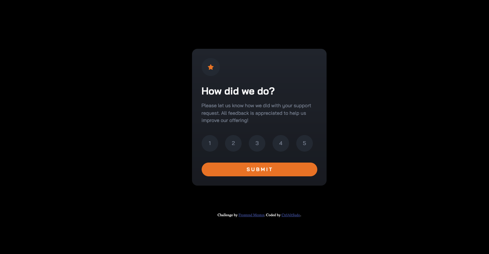

<h1 align="center">Interactive rating component</h1>

 <a align="center" href="https://ctrlaltsudo.github.io/Interactive-rating-component/">Live Demo</a>

 <a align="center" href="https://www.frontendmentor.io/solutions/interactive-rating-component-cIXuR-ixdH">Solution Page</a>

<h2 align="center">Project Screenshot<h2>

  </img>

## Description

This is a Frontend Mentor challenge, click the link above to visit the challenge page. 

## Built with 

HTML

CSS

Flexbox

Vanilla JS

## What I learnt 

This is my first Javascript challenge by Frontend Mentor, the javascript took a long time to figure out and I had to resort to ChatGPT on a few occasions but eventually got there. I learned that there are more event listeners, I now know that "mouseover" is really useful, I couldn't figure how to get the hover CSS class to stop taking an affect on a selected li element until ChatGPT introduced me to mouseover listener. 

## Authors

<a href="https://github.com/CtrlAltSudo">CtrlAltSudo</a>.

## Acknowledgments

Stack overflow, Google and ChatGPT still prove to be valuable resources! 